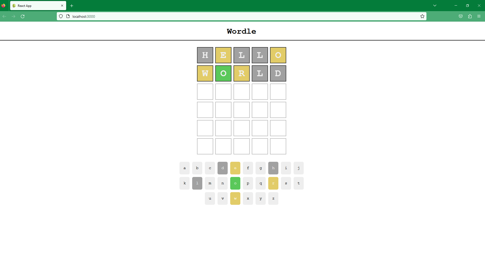

# Wordle Clone with Server

## Description

This full-stack project clones the classic online word game "Worldle" that runs daily on the New York Times website. The rules are simple, guess a 5 letter word in up to 6 guesses, with colorised letter prompts guiding your responses (more in depth rules below in usage section). The base frameworks for this project are React, Node, Express and Json with a number of node package modules tying the project together. The front-end and logic of the game is built and assembled in react. I also created a restful API with Express.js, which utilises both GET and POST methods to log a scores table for users to log and view their scores as JSON data.

In understaking this project I created an enjoyable and functional game. The main focus of me undertaking this project was for me to develop my frontend and logic skills in React, as well as learning how to build a restful API with node and express. I now have an understanding of how to build a full-stack app, tying together the frontend and backend, GETing and POSTinf data between the two.

## Installation

In order to run the forntend app with the server highscores feature you can use the following deoployed link:

https://wordle-clone-jamesrobertsutcliffe.vercel.app/

In order to run the full version of this app you will have to download all files from the repo and install all dependencies, then run the project in your browser. Step by step instructions are as follows:

1 - Download all files from this github repo.
2 - Open containing folder of both downloaded folders in VS code. 
3 - Open the terminal directory folder at downloaded 'SERVER' folder and enter 'npm install' to install dependencies for the server.
4 - Open the terminal directory folder at downloaded 'worldle' folder and enter 'npm install' to install dependencies for the game.
5 - Naviage back to the 'SERVER' folder in the terminal and run 'npm run dev', this will start the server in Local Host:5000.
6 - Navigate back to the 'wordle' folder in the terminal and run 'npm start'. The app will open in your browser and you can begin playing.

**HINT** -- YOU CAN SEE THE CORRECT ANSWER LOGGED TO THE CONSOLE TO SKIP TO THE SCORES BOARD SERVER FEATURE.

## Usage

Use your keypad to make your guess by typing letters and using the enter key. Try to work out the solution by the hints obtained from previous guesses signified by coloured letters. If you win the game you can input your name and see this added to the scoreboard pulled from the created API server.

The rules of the same are as follows:

- You have to guess the Wordle in six goes or less
- A correct letter turns green
- A correct letter in the wrong place turns yellow
- An incorrect letter turns gray
- Letters can be used more than once
- Answers are never plurals

#

## Credits

N/A.

## License

please see license file in main branch of gitHub repository.

## Features

* Polished frontend with game logic built using React
* RESTful API server built with node and express.js
* Word data pulled from external dictionary API
* A number of node package modules utilised

## Languages / Frameworks

* React (HTML, CSS, Javascript)
* Node
* Express

## Node Package Modules / Librares

* EXPRESS
* BODY-PARSER
* AXIOS
* NODEMON

## Deployed Site

https://wordle-clone-jamesrobertsutcliffe.vercel.app/

